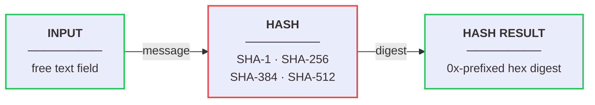

<div align="center">

# 🔐 Cryptographic Converter

**Hashing, made visible.**

A node-graph playground where text flows through a hash node and the digest comes out the other
side — recomputed on every keystroke, entirely in your browser.

<p>
  
  
  
  
  
</p>

[The idea](#the-idea) · [Nodes](#-the-graph) · [How it works](#-how-it-works) · [Setup](#-run-it-locally)

</div>

---

## The idea

Hashing is usually taught as a black box. Text goes in, a hex string comes out, and the only thing
you really learn is that the output looks random and the length never changes.

Turning it into a graph makes the parts addressable. The input, the algorithm and the digest are
three separate things on screen at once, wired together, and you can watch the relationship
between them: change one character and the entire digest changes; switch SHA-256 to SHA-512 and
the output doubles in length. The avalanche effect stops being a sentence in a textbook and
becomes something you can see happening.

## 🕸 The graph



| Node | What it does |
|---|---|
| **Input** | A text field. Every keystroke propagates downstream immediately. |
| **Hash** | Algorithm selector — **SHA-1**, **SHA-256**, **SHA-384**, **SHA-512**. |
| **Hash Result** | The digest as a `0x`-prefixed hex string, full value on hover. |

Nodes are draggable, edges are animated, and the canvas pans and zooms.

## ⚙️ How it works

Digests are computed with the browser's native
[**Web Crypto API**](https://developer.mozilla.org/en-US/docs/Web/API/SubtleCrypto/digest) —
no crypto library, no bundle weight, and no network round-trip. What you type never leaves the page.

```ts
export async function getHashSteps(message: string, algorithm = "SHA-256") {
  const data = new TextEncoder().encode(message);
  const hashBuffer = await crypto.subtle.digest(algorithm, data);

  const hex = "0x" + Array.from(new Uint8Array(hashBuffer))
    .map((b) => b.toString(16).padStart(2, "0"))
    .join("");

  return { hex };
}
```

Two implementation details worth noting:

**State lives in React context, not in node data.** Each node type pulls what it needs from a
shared `HashContext`, which means the nodes and edges arrays are `useMemo`'d once and never
rebuilt. React Flow re-renders node *contents* on state change without recalculating graph layout.

**The async hash is cancellation-guarded.** `crypto.subtle.digest` returns a promise, and typing
fast enough fires several before the first resolves. A `cancelled` flag in the effect's cleanup
discards stale results, so the displayed digest always matches the current input — never whichever
promise happened to land last.

## 🚀 Run it locally

```bash
git clone https://github.com/prakashshuklahub/cryptographic-converter.git
cd cryptographic-converter
npm install
npm run dev
```

Open the URL Vite prints — usually `http://localhost:5173`.

| Script | Does |
|---|---|
| `npm run dev` | Dev server with HMR |
| `npm run build` | Production build to `dist/` |
| `npm run preview` | Serve the production build locally |
| `npm run lint` | ESLint |

## 🧪 Things to try

- Type `hello`, then change it to `hellp`. Watch how much of the digest changes for one letter.
- Switch between SHA-256 and SHA-512 with the input fixed — same message, different length, no shared prefix.
- Empty the input entirely. Hashing nothing still produces a digest, and it's always the same one.

> [!WARNING]
> This is a learning tool, not a security tool. **SHA-1 is included for illustration only** — it is
> broken for collision resistance and must not be used where that matters. And no member of the
> SHA-2 family is appropriate for passwords: use a purpose-built KDF such as Argon2, scrypt or bcrypt.

---

<div align="center">

Built by **[Prakash Shukla](https://github.com/prakashshuklahub)**

[The Hustling Engineer](https://www.youtube.com/@TheHustlingEngineer) · [LinkedIn](https://www.linkedin.com/in/prakash-shukla/)

</div>
